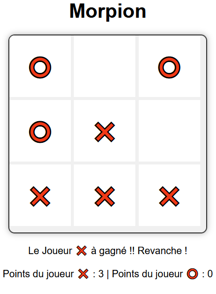
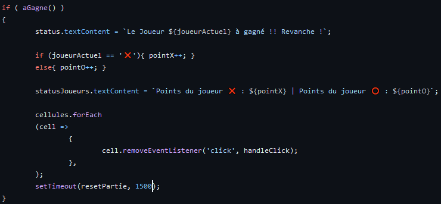

# Compte-Rendu du Projet Docker SAE 2.03

## Introduction

Dans le cadre de la SAE 2.03 sur l'installation de services réseaux avec Docker, notre équipe a entrepris de réaliser un projet collaboratif. Ce compte-rendu présente notre démarche, nos résultats et nos apprentissages tout au long de ce projet.

## Équipe 01

- **Membres de l'Équipe :**
  - Dujardin Thao
  - Harel Théo
  - Oyer Julien
  - Mangeant Thibault

## Début du projet 

- Tout d'abord nous avons répartis les tâches.
  - Thibault et Théo on fait le code java de morpion et ont installé JavaScript sur Docker
  - Thao a réécris le code morpion en JavaScript.
  - Julien s'est occupé de faire un projet de secours au cas où le morpion ne serait livré à l'heure

- Nous avons ensuite commencé ce projet par décider quel serait notre produit, nous avons décidé de manière unanime de faire un morpion.
Il se présente de la manière suivante :
  L'utilisateur 1 (X) choisi une case , puis l'utilisateur 2 (O) , puis l'utilisateur 1 ,  jusqu'à que 3 même symbole soit alignés ou qu'il n'y ait plus de cases libre.
  Alors la partie revient au stade initial avec un tableau de case vides.

### Étape 1 : Début du morpion 

Le morpion commence avec une situation initiale où le tableau de case est vide. 

 

### Étape 2 : Fonctionnement du jeu

Donc à chaque tour chaque joueur choisi une case l'un après l'autre , biensur chaque joueur ne peut sélectionner un case déjà occupé.

 

### Étape 3 : Fin de partie

La partie se termine en cas d'alignement de trois même symbole ou de situation nulle ( où il n'y a plus d'espaces libres )

 

 
